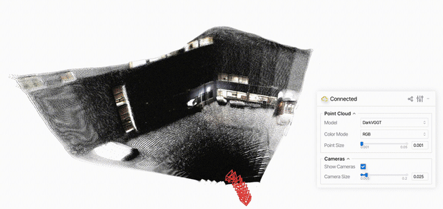

<div align="center">
  

  <h3>Seeing Through Darkness Using Thermal Geometry without Daylight Tax</h3>

  <hr>

  

  <p>
    <a href="https://arxiv.org/abs/2606.11326"></a>
    <a href="https://darkvggt.github.io/"></a>
  </p>

  <p>
    <a href="https://mnseong.github.io/">Minseong Kweon</a> &middot;
    <a href="https://wyzhao23.github.io/">Wenyuan Zhao</a> &middot;
    <a href="https://nuochen1203.github.io/">Nuo Chen</a> &middot;
    <a href="https://lulinliu.github.io/">Lulin Liu</a>
    <br>
    <a href="https://darkvggt.github.io/">Huiwen Han</a> &middot;
    <a href="https://scholar.google.com/citations?user=YfuA8zoAAAAJ&hl=en">Zihao Zhu</a> &middot;
    <a href="https://engineering.tamu.edu/electrical/profiles/sshakkottai.html">Srinivas Shakkottai</a> &middot;
    <a href="https://tiangroup.engr.tamu.edu/">Chao Tian</a> &middot;
    <a href="https://phai-lab.github.io/index.html">Zhiwen Fan</a>
  </p>
</div>

## Overview

<p align="center">
  
</p>

<p align="justify">
<strong>DarkVGGT</strong> is an RGB-Thermal feed-forward framework for robust 3D geometry estimation in low-visibility environments. Our model leverages complementary thermal pathways and selective thermal-to-RGB routing to recover reliable geometric cues under degraded RGB conditions. This improves dark-scene reconstruction while largely preserving VGGT’s well-lit performance.
</p>

## Quick Start

### Installation

```bash
git clone git@github.com:phai-lab/DarkVGGT.git
cd DarkVGGT

conda create -n darkvggt python=3.10 -y
conda activate darkvggt

pip install -r requirements.txt
```

Download the [VGGT-1B](https://github.com/facebookresearch/vggt) and pretrained [DarkVGGT](https://drive.google.com/file/d/1qgbIvaFd564vRrRRhJsCmhz2Jk-xigPk/view?usp=sharing) checkpoints. Create a `checkpoints/` folder in the repository root and place both files under it.

### Use DarkVGGT on sample sequence

We provide sample RGB-Thermal sequences for demo inference. The following command launches a [viser](https://github.com/viser-project/viser.git) viewer to visualize the point cloud and camera poses predicted by DarkVGGT:

```bash
python demo_viser.py --scene_dir ./samples
```

<p align="center">
  
</p>

Our demo viewer enables direct comparison of reconstruction quality with the VGGT baseline.

### Use DarkVGGT on custom sequence

Lay out your own RGB-T pair the same way as `samples/` and then run the model directly with the following script:

```python
import torch
from inference import build_model, list_images, load_thermal_images
from darkvggt.utils.load_fn import load_and_preprocess_images

device = "cuda" if torch.cuda.is_available() else "cpu"
model = build_model("checkpoints/vggt_1b.pt", "checkpoints/darkvggt.pt", device)

rgb_path, thermal_path = "path/to/rgb", "path/to/thermal"
rgb = load_and_preprocess_images(list_images(rgb_path)).to(device)
thermal = load_thermal_images(thermal_path, list_images(rgb_path)).to(device)

with torch.no_grad():
    predictions = model(rgb, thermal)

"""
Outputs:
    - predictions['depth']: predicted depth map
    - predictions['pose_enc']: predicted camera pose encoding
    - predictions['world_points']: 3D point cloud from the point head
"""
```

### Export COLMAP format

The following script converts a paired RGB-T sequence to COLMAP format:

```bash
python demo_colmap.py --scene_dir=/YOUR/SCENE_DIR/
```

Please ensure that images exist under `--scene_dir`'s `rgb` and `thermal` paths. The reconstruction result is saved under `--output_dir` (defaults to `/YOUR/SCENE_DIR/colmap`).

## What to expect

- [x] Pretrained weights
- [x] Inference code
- [ ] Training & evaluation code

## Acknowledgements

This codebase builds on the [VGGT](https://github.com/facebookresearch/vggt). We thank the authors for their great work!

## Citations

```bibtex
@article{kweon2026darkvggt,
  title={DarkVGGT: Seeing Through Darkness Using Thermal Geometry without Daylight Tax},
  author={Kweon, Minseong and Zhao, Wenyuan and Chen, Nuo and Liu, Lulin and Han, Huiwen and Zhu, Zihao and Shakkottai, Srinivas and Tian, Chao and Fan, Zhiwen},
  journal={arXiv preprint arXiv:2606.11326},
  year={2026}
}
```
